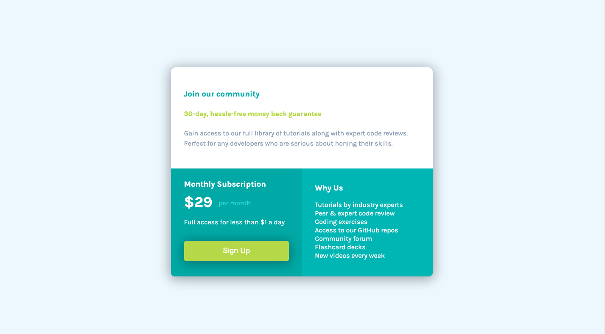

# Frontend Mentor - Single price grid component solution

This is a solution to the [Single price grid component challenge on Frontend Mentor](https://www.frontendmentor.io/challenges/single-price-grid-component-5ce41129d0ff452fec5abbbc). Frontend Mentor challenges help you improve your coding skills by building realistic projects. 

## Table of contents

- [Overview](#overview)
  - [The challenge](#the-challenge)
  - [Screenshot](#screenshot)
  - [Links](#links)
- [My process](#my-process)
  - [Built with](#built-with)
  - [What I learned](#what-i-learned)
  - [Continued development](#continued-development)
  - [Useful resources](#useful-resources)
- [Author](#author)


## Overview

### The challenge

Users should be able to:

- View the optimal layout for the component depending on their device's screen size
- See a hover state on desktop for the Sign Up call-to-action

### Screenshot




### Links

- Solution URL: [github.com/Rod-Barbosa/single-price-grid-component.git](https://github.com/Rod-Barbosa/single-price-grid-component.git)
- Live Site URL: [Add live site URL here](https://your-live-site-url.com)

## My process

### Built with

- Semantic HTML5 markup
- CSS custom properties
- Flexbox
- CSS Grid
- Mobile-first workflow

### What I learned

This was way faster than I expected. Just got stuck on the grid-area property. I forgotabout it and it took me 30 mins to redescover it existed. Thank god I'm not back to wrapper divs

```css
    .main {
        margin: 20vh 27.5vw;
        border-radius: 10px;
        display: grid; 
        grid-template-columns: 1fr 1fr; 
        grid-template-rows: auto auto; 
        gap: 0px 0px; 
        grid-template-areas: 
          "header header"
          ". ."; 
    }
    .top{
        padding: 5% 5%;
        grid-area: header;
        border-top-left-radius: 10px;
        border-top-right-radius: 10px;
    }
```

### Continued development

Today I've done social media posting of yesterday's work, and finished today's challenge. Maybe I should push for an extra one? IDK. Maybe it is time to learn how to do other things different from coding.

### Useful resources

- [CSS Grid](https://css-tricks.com/snippets/css/complete-guide-grid/) - Once again this page proves itself to be an MVP resource

## Author

- Website - [Rodrigo Barbosa](https://www.gelatodigital.com)
- Frontend Mentor - [@Rod-Barboa](https://www.frontendmentor.io/profile/Rod-Barbosa)